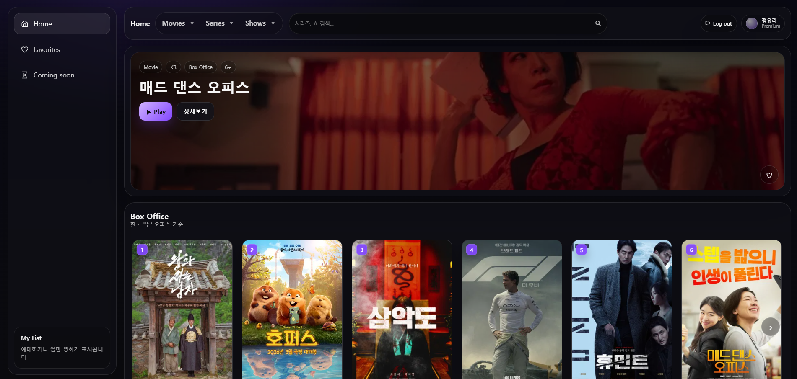
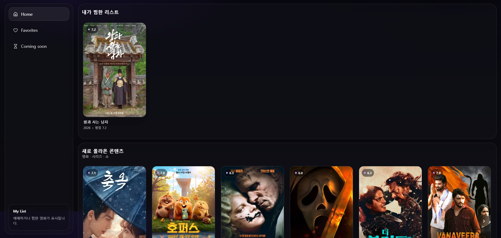
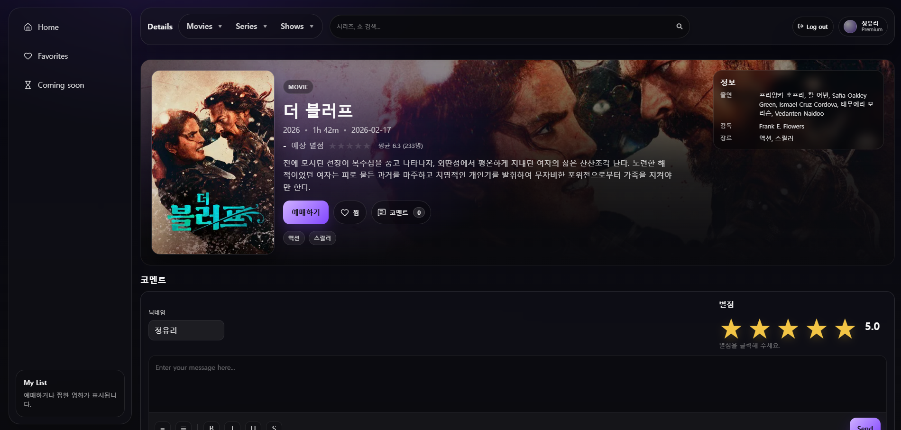
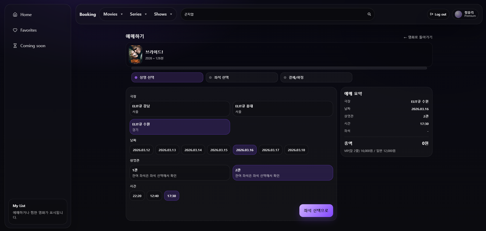
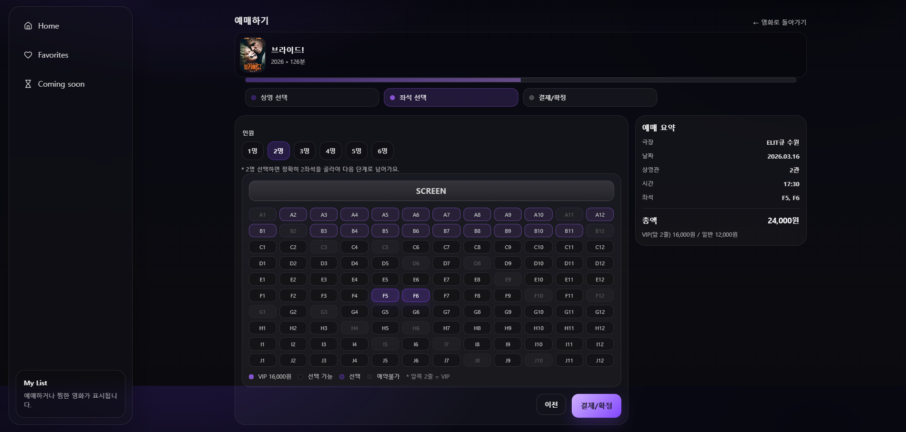
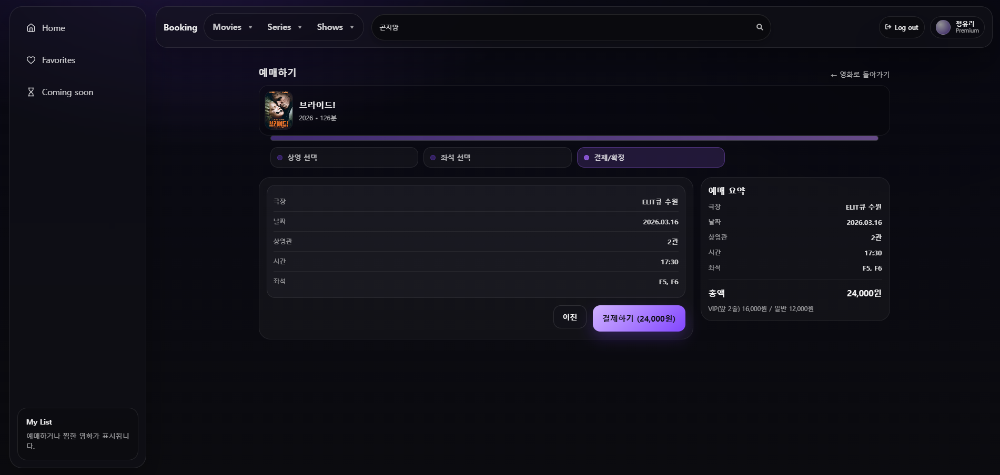
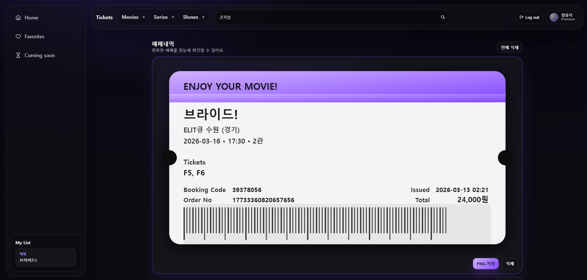
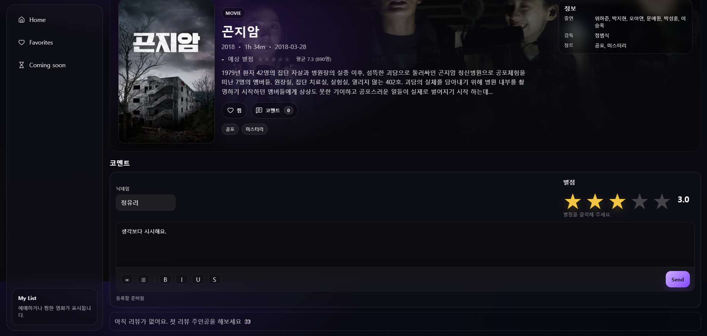
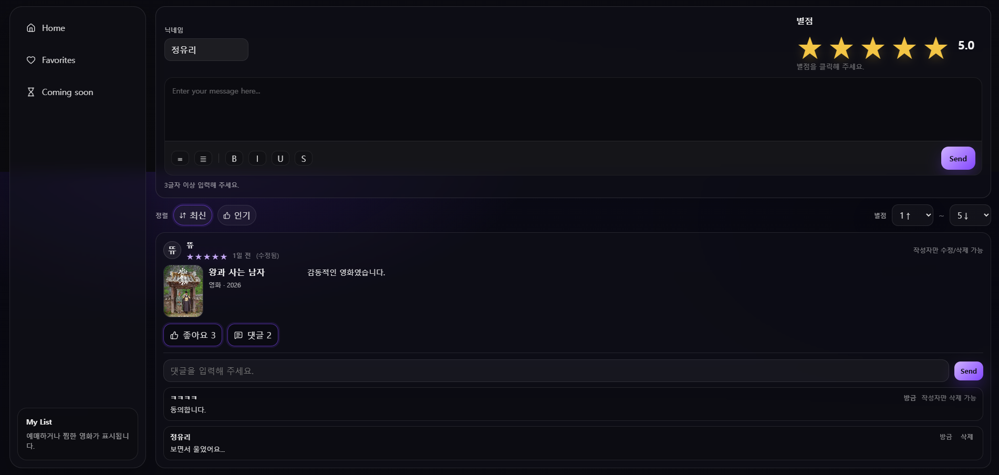
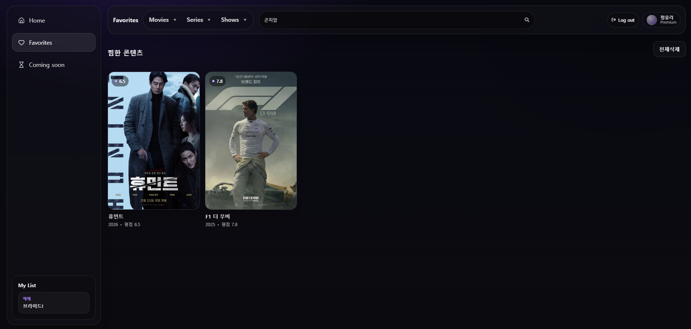

# 🎬 Filmate

영화 · 시리즈 정보를 탐색하고  
리뷰, 별점, 찜 기능을 사용할 수 있는 **React 기반 영화 콘텐츠 웹 애플리케이션**입니다.

TMDB 및 한국 박스오피스 데이터를 기반으로  
사용자가 콘텐츠를 탐색하고 의견을 공유할 수 있도록 제작했습니다.

---

# ✨ Features

## 🎥 콘텐츠 탐색

- Box Office 영화 랭킹
- 랜덤 추천 콘텐츠
- 최신 콘텐츠 목록
- 장르 기반 콘텐츠 탐색

---

## ⭐ 리뷰 시스템

- 별점 평가
- 코멘트 작성
- 댓글 및 답글 기능
- 좋아요 기능

---

## ❤️ 사용자 기능

- 찜 목록 관리
- 로그인 기반 리뷰 작성
- 개인 리뷰 관리

---

## 🎬 상세 페이지

- 영화 / 시리즈 상세 정보
- 출연 배우
- 감독 / 제작자
- 장르 정보
- 리뷰 통계

---

## 🎟 예매 기능

- 상영 중 영화 예매
- 좌석 선택
- 티켓 저장

---

# 🧱 Tech Stack

## Frontend
- React
- React Router

## API
- TMDB API
- KOBIS Box Office API

## Styling
- CSS Modules
- Custom Design Tokens

## 기타
- LocalStorage (리뷰 / 찜 데이터)
- Lucide Icons

---

# 📂 Project Structure

```text
src
├─ api/            # 외부 API 호출
├─ app/            # 전역 상태 관리
├─ components/     # 재사용 컴포넌트
├─ hooks/          # 커스텀 훅
├─ lib/            # 유틸 함수
├─ pages/          # 페이지 컴포넌트
├─ styles/         # 전역 스타일 / 디자인 토큰

public/            # 정적 리소스
```

---

# 📸 Screenshots

### Home



랜덤 추천 영화 및 박스오피스 랭킹

### Detail


영화 / 시리즈 상세 정보

### Ticket





영화 예매 기능 및 좌석 선택 UI  
선택한 좌석 정보를 기반으로 티켓을 생성하고 저장

### Review



리뷰 작성 및 댓글 시스템

### Favorites


사용자가 찜한 영화 및 시리즈를 모아볼 수 있는 목록 페이지

---

# 🔑 Environment Variables

프로젝트 실행을 위해 `.env` 파일이 필요합니다.

```bash
VITE_TMDB_API_KEY=your_tmdb_api_key
VITE_KOBIS_API_KEY=your_kobis_api_key
```

보안을 위해 `.env` 파일은 GitHub에 업로드하지 않습니다.

---

# 🚀 How to Run

## 1️⃣ 프로젝트 설치

```bash
npm install
```

## 2️⃣ 개발 서버 실행
```bash
npm run dev
```
---

# 📌 Future Improvements

- 사용자 계정 시스템
- 서버 기반 리뷰 저장
- 콘텐츠 추천 알고리즘
- 검색 기능 개선